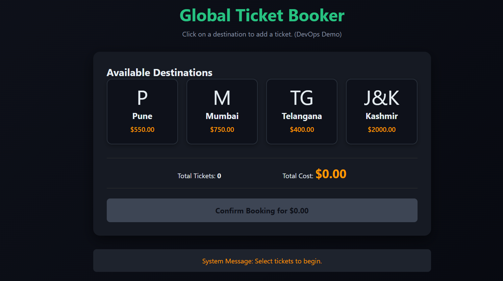
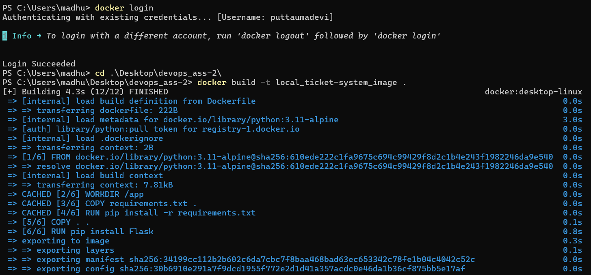
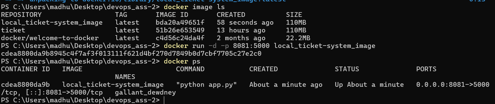
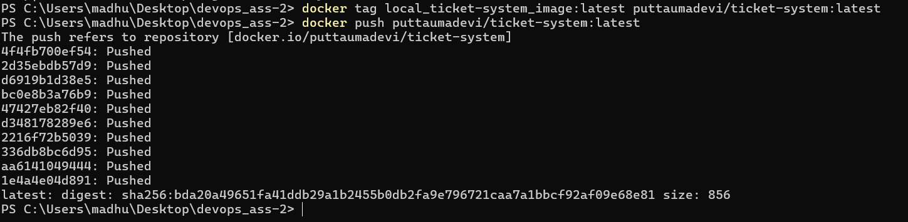
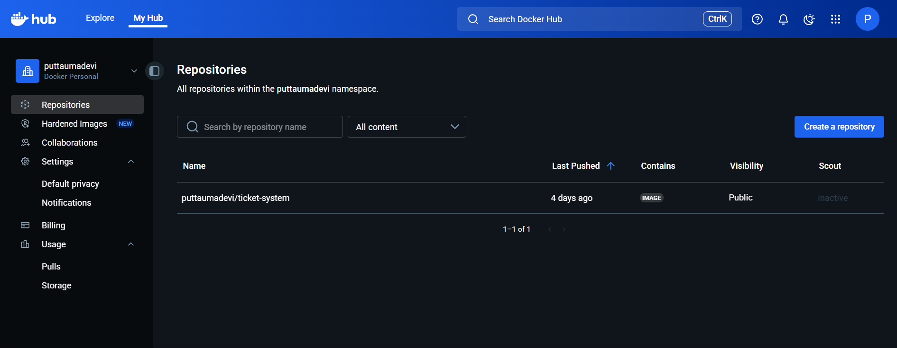

Task : Implementing a complete automated workflow that covers version control, containerization, 
continuous integration, continuous delivery, and orchestration.

Step followed :

STEP - 1 : application

Built a simple application for the ticket booking system using HTML,CSS,JavaScript and a simple backend using python-flask

STEP - 2 : Dockerize

1) create dockerfile
2) In powershell : Docker Login , Build docker image , contanierize it , and run the container

Commands :
> docker login
> docker build -t tag_name .
> docker run -d -p 8081:5000 image_name
Now open localhost:8081

Now Pushing the image to docker hub

>docker tag <local-image-name> <your-dockerhub-username>/<image-name>:<tag>

> docker push <your-dockerhub-username>/<image-name>:<tag>

STEP - 3 : Pushing the Image to Docker Hub

After testing locally, the image was tagged and pushed to Docker Hub.

Commands :
docker tag ticket-system puttaumadevi/ticket-system:latest
docker push puttaumadevi/ticket-system:latest
(image.png)

STEP - 4 : Jenkins (Continuous Integration & Delivery)

-Installed Jenkins and integrated with GitHub.

-Configured Docker Hub credentials inside Jenkins.

-Created a Jenkinsfile for automation.

-The Jenkins pipeline automates:

-Code checkout from GitHub

-Building Docker image

-Pushing image to Docker Hub

-Deploying the container locally (8083:5000)

-Each code push triggers an automatic CI/CD workflow.

(jenkinspipeline.png)